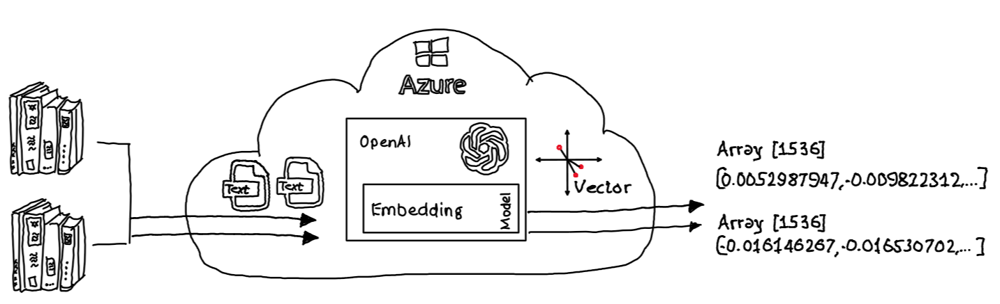

# OpenAI: Clustering with .NET

## Intro

OpenAI embeddings are a way of transforming text into numerical vectors that can capture the meaning and relatedness of provided text. To create vectors out of text, OpenAI embedding models takes the text as input and computes its relevance to 1536 predefined dimensions. The output is a vector or float array of 1536 numbers that represent the text in a lower-dimensional space:

This vector can then be used to cluster the text with other tests that have similar vectors, based on some distance metric.

## Dimensional reduction

To visualize created vectors, e. g. in a two-dimensional diagram, a dimensional reduction method that can preserve the essential information and structure of the data is needed. There are many methods for dimensionality reduction. Some of the most common ones are:

- Principal Component Analysis (PCA)
- Linear Discriminant Analysis (LDA)
- t-distributed Stochastic Neighbor Embedding (t-SNE)

Any of the above methods can be used to visualize clustering of vectors.

## Sample

The [.net sample application](./src/Notebook/Clustering.ipynb) in this repository uses *uniform manifold approximation and projection (UMAP)*. The [UMAP nuget package](https://www.nuget.org/packages/UMAP) provides an implementation which can be easily integrated into .NET applications.

To visualize calculated and dimensional reduced vectors [ScottPlot](https://www.nuget.org/packages/ScottPlot/5.0.8-beta) is used.

To create an Azure OpenAI instance and deploy an embedding model the [Azure CLI script](./src/CreateEnv/CreateEnv.azcli) can be used.

## Summary

Embeddings can be used to execute search queries where results are ranked by relevance to a query string. Which is a often implemented use case to ground prompts before they are sent to a LLM. Clustering and its possibilities is often underestimated and can be easily implemented to identify groups of data points with similar characteristics. Allowing market or customer segregation, anomaly detection, recommendation systems etc.
